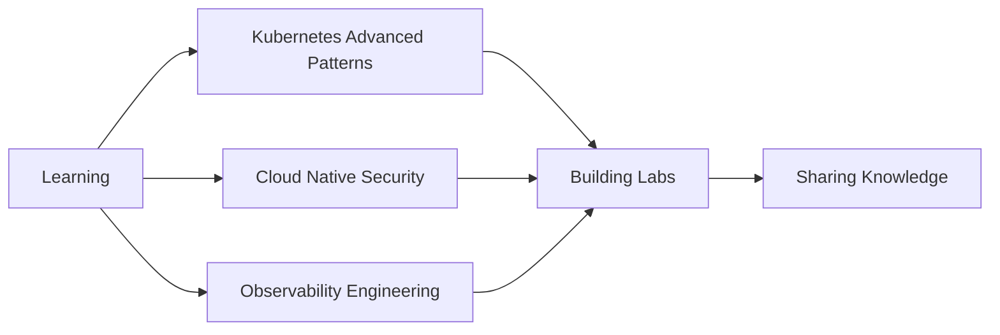

<div align="center">

# 👋 Hello, I'm Alfredo Borges

### DevOps Engineer | Kubernetes Specialist | Cloud & Observability Enthusiast


</div>

<div align="center">

[](https://www.linkedin.com/in/alfredontz)
[](https://github.com/Borgesnt)

</div>

---

## 🎯 About Me

```yaml
name: Alfredo Borges
role: DevOps Engineer
location: Brazil
education: Computer Networks Student
focus:
  - Infrastructure Automation
  - Kubernetes & Container Orchestration
  - CI/CD & GitOps
  - Observability & Monitoring
  - Network Security
motto: "Always learning. Always building. 🔧"
```

🔭 Building production-grade infrastructure with **Kubernetes, Docker, and Cloud-native technologies**

⚡ Expertise in **CI/CD pipelines, GitOps workflows, and Infrastructure as Code**

📊 Deep knowledge of **observability stacks** (Zabbix, Grafana, Prometheus)

🔒 Strong foundation in **networking and security** (pfSense, VLANs, Firewalls)

🎓 Constantly exploring new technologies and best practices

---

## 🛠️ Tech Stack

<div align="center">

### 🐳 Containers & Orchestration


### 🔧 DevOps & Automation


### 📊 Observability & Monitoring


### 🐧 Infrastructure & OS


### 🔐 Networking & Security


</div>

---

## 📊 GitHub Analytics

<div align="center">
  
  
</div>

<div align="center">
  
</div>

---

## 🚀 Featured Projects

<table>
<tr>
<td width="50%">

### 🎯 Kubernetes Labs
**Production-like environment** using:
- Minikube for local development
- Helm charts for package management
- ArgoCD for GitOps workflows
- Automated CI/CD pipelines

**Tech:** `Kubernetes` `Helm` `ArgoCD` `GitOps`

</td>
<td width="50%">

### 📡 pfSense + Zabbix Monitoring
**Enterprise-grade network monitoring:**
- WAN/LAN traffic analysis
- Custom dashboards & alerts
- Network topology mapping
- Performance optimization

**Tech:** `pfSense` `Zabbix` `Grafana` `SNMP`

</td>
</tr>
<tr>
<td width="50%">

### 🔒 Secure Docker Stack
**Security-first container infrastructure:**
- CrowdSec integration
- Nginx Proxy Manager
- SSL/TLS automation
- WAF implementation

**Tech:** `Docker` `CrowdSec` `Nginx` `Let's Encrypt`

</td>
<td width="50%">

### 🔐 Univention LDAP Automation
**Enterprise directory automation:**
- Password expiration notifications
- User provisioning scripts
- Service integrations
- Automated backup workflows

**Tech:** `LDAP` `UCS` `Python` `Shell Script`

</td>
</tr>
</table>

---

## 📈 Contribution Graph

<div align="center">
  
</div>

---

## 💡 Current Focus



---

## 📬 Let's Connect

<div align="center">

**💼 Open to opportunities and collaborations!**

[](https://www.linkedin.com/in/alfredontz)
[](https://github.com/Borgesnt)
[](mailto:your.email@example.com)

</div>

---

<div align="center">

### 🌟 "Infrastructure is not just code, it's poetry in YAML" 🌟


</div>
